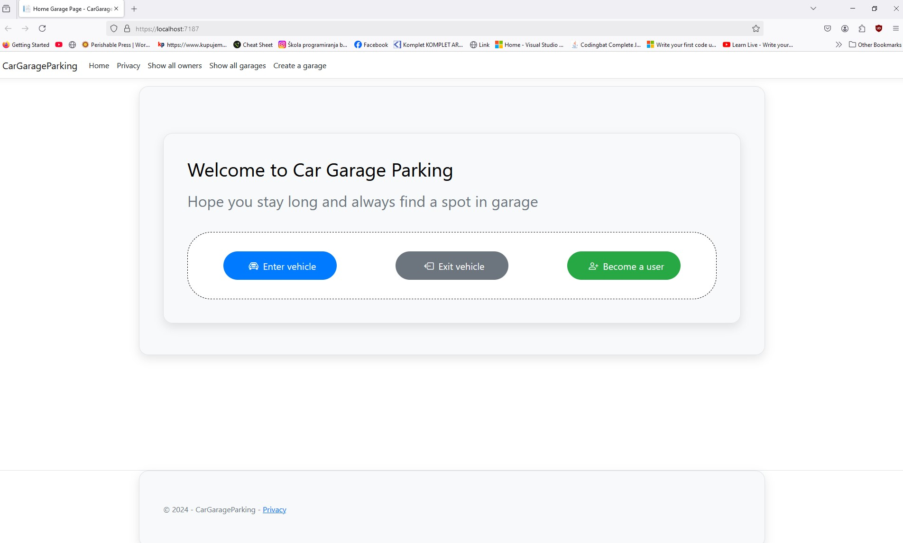
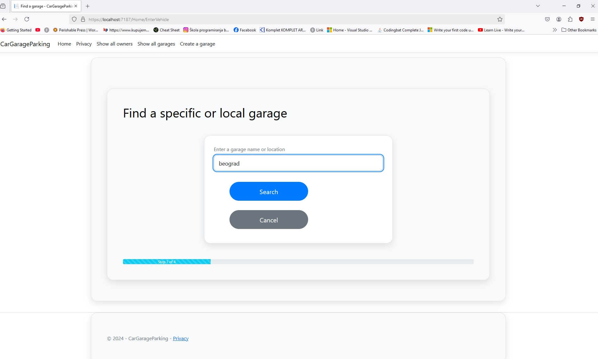
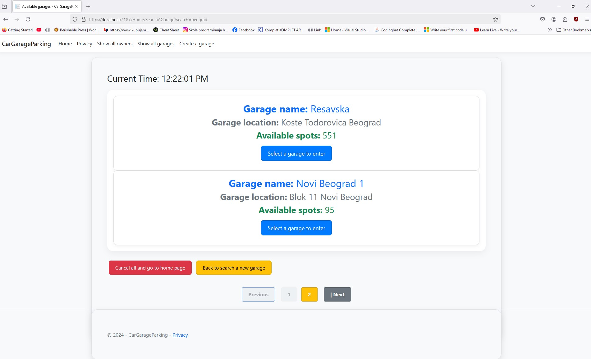
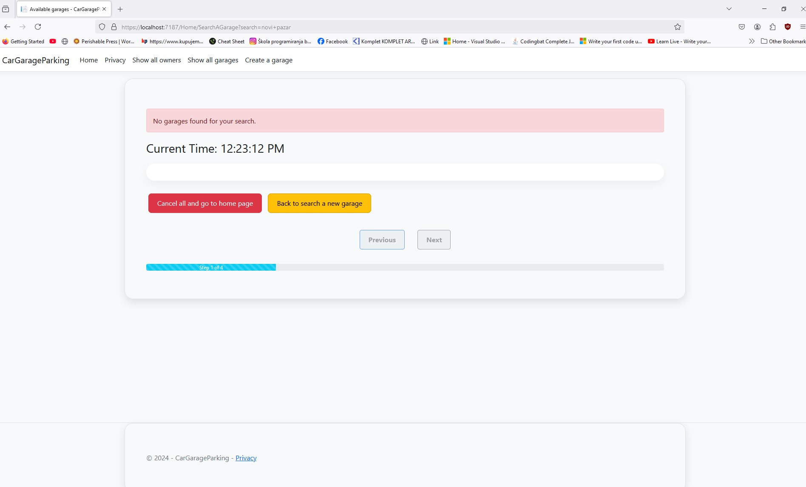
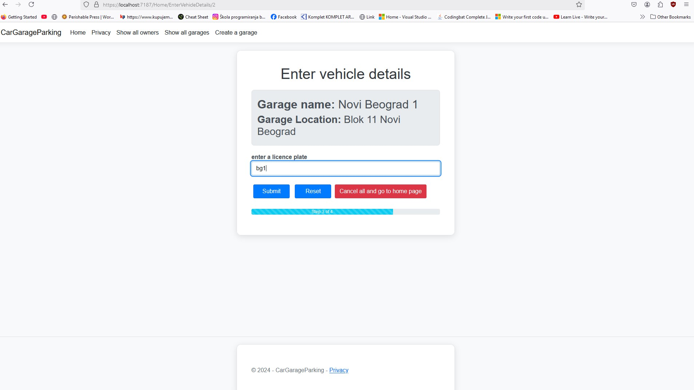
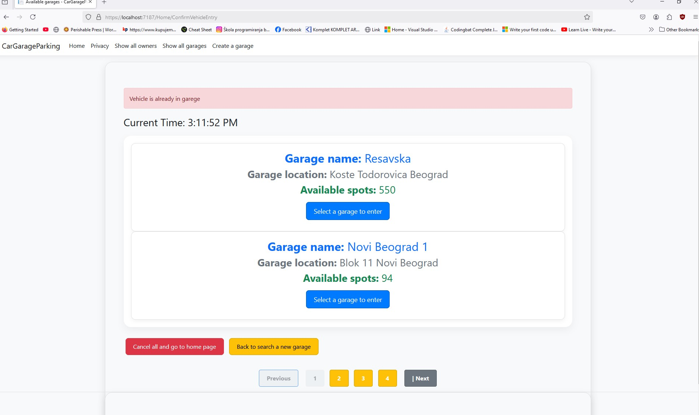
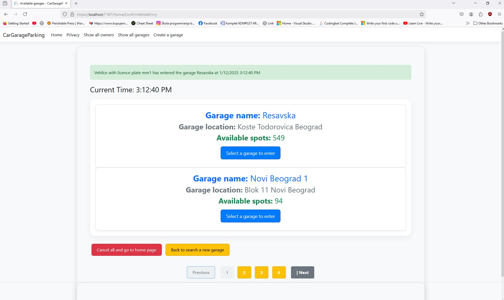

# CarGarageParking

## Opis projekta 
Ova aplikacija omogucava nam da pratimo kad je neko vozilo uslo, izaslo iz garaze, uz evidencije vremena i placanja i istorije poseta, kao i kreiranje novih garaza i vozila. 

## Osnovne funkcionalnosti 
- Pravljenje novih garaza 
- Pravljanje novih vozila 
- Ulazak i izlazk iz garaza 
- Naplata 
- Istorija boravka vozila u garazi
- Aplikacija ako korisnik je registrovan clan 


## Struktura modela 

## A

Application predstavlja model koji povezuje korisnika (Owner) sa njegovim vozilima i kreditima u aplikaciji.

### Application

```csharp
public class Application
{
    public int ApplicationId { get; set; }

    public int OwnerId { get; set; }

    public Owner Owner { get; set; }

    public ICollection<Vehicle> Vehicles { get; set; } = new List<Vehicle>();

    public decimal Credit { get; set; }

    public bool HasActiveMembership { get; set; }   
}
```

- `ApplicationId`: jedinstvaeni identifikator. 
- `OwnerId`: strani kljuc ka entitetu `Owner`.
- `Vehicles`: kolekcija vozila povezanih sa apliakacijom.
- `Credit`: Kredit koji korisnik moze da koristi za popuste ili placanja.
- `HasActiveMembership`: Da li korisnik ima aktivno clanstvo.  

## V

Vehicle je model za osnovne podatke o vozilu, koja ima njegov geristarski broj i podaci o vlasniku. 

### Vehicle (Vozilo)

```csharp
public class Vehicle
{
    public int VehicleId { get; set; }

    public string LicencePlate { get; set; }

    public int? OwnerId { get; set; }

    public Owner? Owner { get; set; }
}
```
- `VehicleId` : jedinstveni identifikator.
- `LicencePlate` : registracioni broj vozila.
- `OwnerId`: strani kljuc ka entitetu `Owner`.
- 'Owner' : veza ka korisniku `Owner`.

## G

Garaza je ima osnove podatke o sebi, kao sto su ime, lokacija, kapacitet, trenutnu zauzetost , slobodnoa mesta  i listu vozila koja su trenutno u njoj.

### Garage 

```csharp
 public class Garage
{
    public int GarageId { get; set; }

    public string Name { get; set; }

    public string Location { get; set; }

    public int Capacity { get; set; }

    public int CurrentOccupancy { get; set; }

    public int AvailableSpots { get
        {
            return Capacity - CurrentOccupancy;
        }
    }
    public ICollection<VehicleInGarage> VehicleInGarage { get;set; } = new List<VehicleInGarage>(); 

    public bool IsFull { get
        {
             return CurrentOccupancy >= Capacity;
        } 
    }
}
```

- `GarageId` : jedinstveni identifikator.
-  `Name` : ime garaze.
-  `Location` : lokacija garaze.
-  'Capacity' : ukupan broj parking mesta.
-  `CurrentIccupancy` : broj trenutno zauzetih mesta
-  `AvailableSposts` : broj slobodnih mesta koji se automatski izracunava oduzimanjem ukupnog broja sa brojem trenutno zauzetih mesta.
-  `IsFull` : oznaka da li je garaza puna , oznacava  da je broj zauzatih mesta  veci ili jednak ukupnom broju parking mesta.
-  `VehicleInGarage` : kolekcija vozila koja se trenutno nalaze u garazi.

## VIG

Ovaj model predstavlja vezu izmedju vozila sa jedne strane i garaze sa druge i to fizicki predstavlja vozilo u garazi, koje ima svoj id. Takodje sadrzi spoljne kljuceve ka Vehicle i Garazi i od dodatnik properitija vremena ulaska i izlaska, kao i cene po satu i proveru da li je vozilo jos uvek u garazi.

### VehicleInGarage

```csharp
public class VehicleInGarage
{
    public int VehicleInGarageId { get; set; }

    public int VehicleId { get; set; }

    public Vehicle Vehicle { get; set; }

    public int GarageId { get; set; }

    public Garage Garage  { get; set; }

    public DateTime EntryTime { get; set; }

    public DateTime? ExitTime { get; set; }

    public decimal HourlyRate { get; set; }

    public int? OwnerId { get; set; }

    public Owner? Owner { get; set; }

    public bool IsVehicleStillInGarage { get; set; } = true;   
    
}
```

- `VehicleInGarageId` : jedinstevni identifikator.
- `VehicleId` : strani kljuc ka entititenu `Vehicle`.
- `Vehicle`: veza ka entitetu `Vehicle` .
- `GarageId`: strani kljuc ka entitetu `Garage`.
- `Garage` : veza ka entitetu `Garage`.
- `EntryTime` : vreme ulaska u vozila u garazu.
- `ExitTime` : vreme izlaska vozila iz garaze.
- `HourlyRate` : cena po satu parkiranja.
- `OwnerId` : strani kljuc ka entitetu `Owner`.
- `Owner` : veza ka entititu `Owner`.
- `IsVehicleStillInGarage` : proverava da li je vozilo jos u garazi.

  ## P

Ovaj model je zaduzen za placanje, koji povezuje koja je ukupna kolicina placenja, kad i koje vozilo koje je bilo u garazi ja zaduzeno za taj iznos 

### Payment

```csharp
 public class Payment
{
    public int PaymentId { get; set; }

    public decimal TotalCharge { get; set; }

    public bool IsPaid { get; set; }

    public DateTime PaymentTime { get; set; }

    public DateTime ExpirationTime { get; set; }  // payment time + 15 minuta ili krece novi obracun 

    public int VehicleInGarageId { get; set; }

    public VehicleInGarage VehicleInGarage { get; set; } = null!;
}
```
- `PaymentId` : jedinsteni identifikator.
- `TotalCharge`: ukupan iznos za placanje.
- `IsPaid`: provera da li je racun placen.
- `PaymentTime` : vreme kad je placanje izvrseno.
- `ExpirationTime` : vreme do kada vozilo mora da napusti garazu ili krece nova naplata.
- `VehicleInGarage`: strani kljuc  ka entitetu `VehicleInGarage`.
- `VehicleInGarage` : veza ka entitetu `VehicleInGarage`.

  ## O
  
Model koji predstavlja vlasnika ili vec korisnika vozila, zbog kasnijeg prosirenja aplikacije, kao bi imali podatke o njemu  i odredjene popuste .
### Owner
```csharp
public class Owner
{
    public int OwnerId { get; set; }

    public string FirstName { get; set; }

    public string LastName { get; set; }

    public ICollection<Vehicle> Vehicles { get; set; } = new List<Vehicle>();

}
```
- `OwnerId` : jedisnteveni identifikator.
- `FirstName` : ime korisnika.
- `LastName` : prezime korisnika.
- `Vehicles` : kolekcija vozila koje korisnik poseduje.

   

## Instrukcije za instalaciju i pokretanje
1. Klonirajte repozitorijum:
   ```bash
   git clone <link>
   ```
2. Instalirajte potrebne pakete:
   ```bash
   dotnet restore
   ```
3. Pokrenite migracije za bazu:
   ```bash
   dotnet ef database update
   ```
4. Pokrenite aplikaciju:
   ```bash
   dotnet run
   ```

## Kako koristiti aplikaciju
- **Dodavanje garaze**: Korisnik moze registrovati novu garazu sa nazivom, lokacijom, kapacitetom i cenom po satu.
- **Dodavanje vozila**: Registracija vozila sa informacijama o registarskim oznakama i vlasniku vozila.
- **Evidencija ulaska/izlaska**: Zapisivanje vremena ulaska i izlaska vozila u/iz garaze.
- **Naplata**: Automatski obracun cene na osnovu vremena provedenog u garazi.

## Tehnički detalji
- **Platforma**: .NET Core 8
- **ORM**: Entity Framework Core
- **Baza podataka**: SQL Server


## istorija radova 
### 1)  Kreiranje modela koji su navedeni 
- Vehicle,
- VehicleInGarage,
- Garage,
- Owner,
- Payment,
- Application

- ### 2)  Kreiranje controlera koji su navedeni 
- **OwnerControler,**
- VehicleInGarage,
- **GarageControler,**
- Owner,
- Payment,
- Application

-  ### 3)  Kreiranje View za modele koji su navedeni 
- **Owner** - `Index`, `Info`
- VehicleInGarage,
- **Garage** -`Index`,`Info`
- Owner,
- Payment,
- Application

 -  ### 4)  Dodavanje datavalidation - validacije u okviru modela

 -  ### Application

```csharp
public class Application
{
    public int ApplicationId { get; set; }

    [Required]
    public int OwnerId { get; set; }

    public Owner Owner { get; set; }

    public ICollection<Vehicle> Vehicles { get; set; } = new List<Vehicle>();

    [Range(0, double.MaxValue ,ErrorMessage = "Credit must be graeter than zero.")]
    public decimal Credit { get; set; }

    public bool HasActiveMembership { get; set; }   
}
```

- `ApplicationId`: jedinstvaeni identifikator. 
- `OwnerId`: strani kljuc ka entitetu `Owner`. neophodno properti
- `Vehicles`: kolekcija vozila povezanih sa apliakacijom.
- `Credit`: Kredit koji korisnik moze da koristi za popuste ili placanja. - mora da ima vrednost vecu od 0 
- `HasActiveMembership`: Da li korisnik ima aktivno clanstvo.  

## V

Vehicle je model za osnovne podatke o vozilu, koja ima njegov geristarski broj i podaci o vlasniku. 

### Vehicle (Vozilo)

```csharp
public class Vehicle
{
    public int VehicleId { get; set; }

    [Required(ErrorMessage = "Licence plate is required.")]
    [StringLength(15,ErrorMessage = "Licence plate can not exced 15 characters.")]

    public string LicencePlate { get; set; }

    public int? OwnerId { get; set; }

    public Owner? Owner { get; set; }
}
```
- `VehicleId` : jedinstveni identifikator.
- `LicencePlate` : registracioni broj vozila. neophodan properti i mora da ima do 15 karaktera 
- `OwnerId`: strani kljuc ka entitetu `Owner`.
- 'Owner' : veza ka korisniku `Owner`.

## G

Garaza je ima osnove podatke o sebi, kao sto su ime, lokacija, kapacitet, trenutnu zauzetost , slobodnoa mesta  i listu vozila koja su trenutno u njoj.

### Garage 

```csharp
 public class Garage
 {
     public int GarageId { get; set; }

     [Required(ErrorMessage ="Garage name is required.")]
     [StringLength(100,ErrorMessage =" Garage name can not exceed 100 characters.")]
     public string Name { get; set; }

     [Required(ErrorMessage ="Location is required.")]
     [StringLength(150,ErrorMessage = "Garage location length can not exceed 150 characters.")]
     public string Location { get; set; }

     [Range(1, int.MaxValue,ErrorMessage ="Capacity must be greater than zero")]
     public int Capacity { get; set; }

     [Range(0,int.MaxValue,ErrorMessage = "Current occupancy can not be nagetive.")]
     [IntTypeGreaterThan("Capacity", ErrorMessage = "Capacity  must be greater or equal than current capacity.")]
     public int CurrentOccupancy { get; set; }

     public int AvailableSpots { get
         {
             return Capacity - CurrentOccupancy;
         }
     }

     public ICollection<VehicleInGarage> VehicleInGarage { get;set; } = new List<VehicleInGarage>(); 

     public bool IsFull { get
         {
              return CurrentOccupancy >= Capacity;
         } 
     }

 }
```

- `GarageId` : jedinstveni identifikator.
-  `Name` : ime garaze. neophdan properti i da je duzina do 100 karaktera 
-  `Location` : lokacija garaze. neophdan properti i da je duzina do 150 karaktera 
-  'Capacity' : ukupan broj parking mesta. Vrednost  da je od 0 do max 
-  `CurrentIccupancy` : broj trenutno zauzetih mesta  Vrednost da je od 0 do max i da poredi od capacity 
-  `AvailableSposts` : broj slobodnih mesta koji se automatski izracunava oduzimanjem ukupnog broja sa brojem trenutno zauzetih mesta.
-  `IsFull` : oznaka da li je garaza puna , oznacava  da je broj zauzatih mesta  veci ili jednak ukupnom broju parking mesta.
-  `VehicleInGarage` : kolekcija vozila koja se trenutno nalaze u garazi.

## VIG

Ovaj model predstavlja vezu izmedju vozila sa jedne strane i garaze sa druge i to fizicki predstavlja vozilo u garazi, koje ima svoj id. Takodje sadrzi spoljne kljuceve ka Vehicle i Garazi i od dodatnik properitija vremena ulaska i izlaska, kao i cene po satu i proveru da li je vozilo jos uvek u garazi.

### VehicleInGarage

```csharp
public class VehicleInGarage
{
    public int VehicleInGarageId { get; set; }

    [Required]
    public int VehicleId { get; set; }

    public Vehicle Vehicle { get; set; }

    
    [Required]
    public int GarageId { get; set; }

    public Garage Garage  { get; set; }

    
    
    [Required(ErrorMessage = "Enrty time is required.")]
    [DataType(DataType.DateTime)]
    public DateTime EntryTime { get; set; }


    [DateGreaterThan("EntryTime", ErrorMessage = "Exit time must be greater than entry time.")]
    [DataType(DataType.DateTime)]
    public DateTime? ExitTime { get; set; }

    [Required]
    [Range(0.01,double.MaxValue,ErrorMessage = "HourlyRate rate must be greather than zero." )]
    public decimal HourlyRate { get; set; }

    public int? OwnerId { get; set; }

    public Owner? Owner { get; set; }

    public bool IsVehicleStillInGarage { get; set; } = true;    
    

}
```

- `VehicleInGarageId` : jedinstevni identifikator.
- `VehicleId` : strani kljuc ka entititenu `Vehicle`. neophodan properti
- `Vehicle`: veza ka entitetu `Vehicle` .
- `GarageId`: strani kljuc ka entitetu `Garage`.   neophodan properti
- `Garage` : veza ka entitetu `Garage`.
- `EntryTime` : vreme ulaska u vozila u garazu.  neopdodan properti i da je tipa date
- `ExitTime` : vreme izlaska vozila iz garaze.  neopdodan properti i da je tipa date i da poredi se sa exit time
- `HourlyRate` : cena po satu parkiranja.  neophodan properti i da ima vrednost od 0 do max
- `OwnerId` : strani kljuc ka entitetu `Owner`.
- `Owner` : veza ka entititu `Owner`.
- `IsVehicleStillInGarage` : proverava da li je vozilo jos u garazi.

  ## P

Ovaj model je zaduzen za placanje, koji povezuje koja je ukupna kolicina placenja, kad i koje vozilo koje je bilo u garazi ja zaduzeno za taj iznos 

### Payment

```csharp
 public class Payment
{
    public int PaymentId { get; set; }

    [Range(0.01, double.MaxValue, ErrorMessage = "Total charge must be greather than zero")]
    [IntTypeGreaterThan("VehicleHorlyRate", ErrorMessage = "Total charge   must be greater or equal than hourly rate.")]
    public decimal TotalCharge { get; set; }

    public bool IsPaid { get; set; }

    [Required(ErrorMessage = "Payment time is required.")]
    [DataType(DataType.DateTime)]

    public DateTime PaymentTime { get; set; }

    [DateGreaterThan("PaymentTime", ErrorMessage = "Expiration date must be greater than payment time.")]
    [DataType(DataType.DateTime)]
    public DateTime ExpirationTime { get; set; }  // payment time + 15 minuta ili krece novi obracun 

    [Required]
    public int VehicleInGarageId { get; set; }

    [Range(0.01,double.MaxValue, ErrorMessage = "Vehicle hourly rate must be greather than zero.")]
    public decimal VehicleHourlyRate { get; set; }
    public VehicleInGarage VehicleInGarage { get; set; } = null!;
}
```
- `PaymentId` : jedinsteni identifikator.
- `TotalCharge`: ukupan iznos za placanje.  da je vrednost veca od 0 do max i da mora da bude veca od vehicleHourlyRate
- `IsPaid`: provera da li je racun placen.
- `PaymentTime` : vreme kad je placanje izvrseno.  neophodan properi i da je i da je tipa datetime 
- `ExpirationTime` : vreme do kada vozilo mora da napusti garazu ili krece nova naplata. neophodan properi i da je i da je tipa datetime  i poredjene sa  payment time 
- `VehicleInGarageId`: strani kljuc  ka entitetu `VehicleInGarage`.  neophoddan properti
- `VehicleInGarage` : veza ka entitetu `VehicleInGarage`.

  ## O
  

### Owner
```csharp
public class Owner
{
    public int OwnerId { get; set; }

    [Required(ErrorMessage = "First name is reqired.")]
    [StringLength(50,ErrorMessage ="First name can not exceed 50 characters.")]
    public string FirstName { get; set; }

    [Required(ErrorMessage = "Last name is required.")]
    [StringLength(50, ErrorMessage ="Last name can not exceed 50 characters.")]
    public string LastName { get; set; }

    public ICollection<Vehicle> Vehicles { get; set; } = new List<Vehicle>();

}
```
- `OwnerId` : jedisnteveni identifikator.
- `FirstName` : ime korisnika. neophodan properti i duzina do 50 karaktera
- `LastName` : prezime korisnika.  neophodan properti i duzina do 50 karaktera 
- `Vehicles` : kolekcija vozila koje korisnik poseduje.


### Util folder koji sadrzi custom klase za validaciju 

### DateGreaterThanAttribute
```csharp
 public class DateGreaterThanAttribute: ValidationAttribute
 {
     private readonly string _comparisonProperty;

     public DateGreaterThanAttribute(string comparisonProperty)
     {
         _comparisonProperty = comparisonProperty;
     }

     protected override ValidationResult? IsValid(object? value, ValidationContext validationContext)
     {
         if (value == null)
         {
             return ValidationResult.Success;
         }

         var currentValue = (DateTime?)value;

         var comparisonProperty = validationContext.ObjectType.GetProperty(_comparisonProperty);

         if (comparisonProperty == null)
         {
             return new ValidationResult($"Uknown property {_comparisonProperty}");
         }

         var comparisonValue = (DateTime?)comparisonProperty.GetValue(validationContext.ObjectInstance);

         if (value == null || comparisonValue == null)
         {
             return ValidationResult.Success;
         }

         if (value != null && comparisonValue != null && currentValue <= comparisonValue)
         {
             return new ValidationResult(ErrorMessage ?? $"{validationContext.DisplayName} must be greater then {_comparisonProperty}");
         }

         return ValidationResult.Success;
     }
 }
```


 Sluzi za poredjenje raznih vremena u nasoj aplikaciji

### IntTypeGreaterThan

```csharp
public class IntTypeGreaterThan :ValidationAttribute
{
       private readonly string _comparisonProperty;

        public IntTypeGreaterThan(string comparisonProperty)
        {
            _comparisonProperty = comparisonProperty;
        }

        protected override ValidationResult? IsValid(object? value, ValidationContext validationContext)
        {
            if (value == null)
            {
                return ValidationResult.Success;
            }

            var currentValue = (int)value;

            var comparisonProperty = validationContext.ObjectType.GetProperty(_comparisonProperty);

            if (comparisonProperty == null)
            {
                return new ValidationResult($"Uknown property {_comparisonProperty}");
            }

            var comparisonValue = (int)comparisonProperty.GetValue(validationContext.ObjectInstance);

            if (value == null || comparisonValue == null)
            {
                return ValidationResult.Success;
            }

            if (value != null && comparisonValue != null && currentValue < comparisonValue)
            {
                return new ValidationResult(ErrorMessage ?? $"{validationContext.DisplayName} must be greater then {_comparisonProperty}");
            }

            return ValidationResult.Success;
        }
    }
 ```

 Sluzi za poredjenje raznih int vrednosti  u nasoj aplikaciji

### Payment :IValidatableObject za validaciju 

```csharp
public class Payment :IValidatableObject
{
    public int PaymentId { get; set; }

    [Range(0.01, double.MaxValue, ErrorMessage = "Total charge must be greather than zero")]
    [IntTypeGreaterThan("VehicleHorlyRate", ErrorMessage = "Total charge   must be greater or equal than hourly rate.")]
    public decimal TotalCharge { get; set; }

    public bool IsPaid { get; set; }

    [Required(ErrorMessage = "Payment time is required.")]
    [DataType(DataType.DateTime)]

    public DateTime PaymentTime { get; set; }

    [DateGreaterThan("PaymentTime", ErrorMessage = "Expiration date must be greater than payment time.")]
    [DataType(DataType.DateTime)]
    public DateTime ExpirationTime { get; set; }  // payment time + 15 minuta ili krece novi obracun 

    [Required]
    public int VehicleInGarageId { get; set; }

    [Range(0.01,double.MaxValue, ErrorMessage = "Vehicle hourly rate must be greather than zero.")]
    public decimal VehicleHourlyRate { get; set; }
    public VehicleInGarage VehicleInGarage { get; set; } = null!;

    public IEnumerable<ValidationResult> Validate(ValidationContext validationContext)
    {
        if (!IsPaid)
        {
            yield return new ValidationResult("Payment has not been completed", new[] { nameof(IsPaid)});
        }

        if ((DateTime.Now - PaymentTime).TotalMinutes > 15)
        {
            VehicleInGarage.EntryTime = ExpirationTime;

            yield return new ValidationResult("You have exceed time to leave a garage, new cycle has started.", new[] { nameof(ExpirationTime) });
        }

        var totalHours = Math.Ceiling((PaymentTime - VehicleInGarage.EntryTime).TotalHours);
        var reiquiredCharge = (decimal)totalHours * VehicleHourlyRate;

        if(TotalCharge < reiquiredCharge)
        {
            yield return new ValidationResult($"Total charge must be at least {reiquiredCharge} based on hourly rate", new[] {nameof(TotalCharge) });
        }
    }
}
```

Dodajemo IvalidateObject za proveru placanja cime mozemo da proverimo da li je placeno, da li je vreme napustanja garaze manje od 15 minuta u odnosu va vreme placanja, ako jeste onda je novi krug se pocinje, 
takodje proveravamo da li je iznos novca koji treba platiti jednak ili vec manji od totalCharge 


### 5)  Povezivanje sa Entity frajmworkom 
 - 1 - instalacija preko nuget managera sledecih paketa
     - Microsoft.EntityFrameworkCore.Entity
     - Microsoft.EntityFrameworkCore.SqlServer
     - Microsoft.EntityFrameworkCore.Tools


- 2  - Dodavanje konekcionog stringa u     appsettings.json
```charp
         {
          "Logging": {
            "LogLevel": {
              "Default": "Information",
              "Microsoft.AspNetCore": "Warning"
            }
          },
          "ConnectionStrings": {
            "DefaultConnection": "Server=DESKTOP-FEP7AFG\\SQLEXPRESS;Database=CarGarageDb;Trusted_Connection=True;MultipleActiveResultSets=True;Encrypt=False;"
          },
          "AllowedHosts": "*"
        }
```

- 3  - Kreiranje klase CarGarageParkingDBContext.cs - koja je spona sa bazom podataka i koristeci DBSetove pravimo tabele u bazi, dok koristeci modelBuilder dodajemo  dodatna ogranicenja

```csharp
using CarGarageParking.Models;
using Microsoft.EntityFrameworkCore;

namespace CarGarageParking
{
    public class CarGarageParkingDBContext : DbContext
    {
        public CarGarageParkingDBContext(DbContextOptions<CarGarageParkingDBContext> options) : base(options) { }

        public DbSet<Application> Applications { get; set; }

        public DbSet<Garage> Garages    { get; set; }

        public DbSet<Owner> Owners { get; set; }

        public DbSet<Payment> Payments  { get; set; }

        public DbSet<Vehicle> Vehicles { get; set; }

        public DbSet<VehicleInGarage> VehicleInGarages { get; set; }

        protected override void OnModelCreating(ModelBuilder modelBuilder)
        {
            modelBuilder.Entity<Garage>()
                 .HasMany(g => g.VehicleInGarage)
                 .WithOne(vg => vg.Garage)
                 .HasForeignKey(vg => vg.GarageId)
                 .OnDelete(DeleteBehavior.Cascade);

            modelBuilder.Entity<Owner>()
                .HasMany(o => o.Vehicles)
                .WithOne(v => v.Owner )
                .HasForeignKey(v => v.OwnerId)
                .OnDelete(DeleteBehavior.SetNull);

            modelBuilder.Entity<Application>()
                .Property(a => a.Credit)
                .HasPrecision(18, 2);

            modelBuilder.Entity<Payment>()
                .Property(p => p.TotalCharge)
                .HasPrecision(18, 2);

            modelBuilder.Entity<Payment>()
               .Property(p => p.VehicleHourlyRate)
               .HasPrecision(18, 2);

            modelBuilder.Entity<VehicleInGarage>()
              .Property(vg => vg.HourlyRate)
              .HasPrecision(18, 2);

        }

    }
}
```

- 4 - Povezivanje u okviru buidera dodajemo servise koji sadrzi konekcioni string

```csharp
  using CarGarageParking;
using CarGarageParking.Services;
using Microsoft.EntityFrameworkCore;

var builder = WebApplication.CreateBuilder(args);

// Add services to the container.
builder.Services.AddControllersWithViews();
builder.Services.AddDbContext<CarGarageParkingDBContext>(options =>
   options.UseSqlServer(builder.Configuration.GetConnectionString("DefaultConnection")));

builder.Services.AddScoped<IOwnerService, OwnerService>();
builder.Services.AddScoped<IVehicleService, VehicleService>();

builder.Services.AddScoped<IUnitOfWork, UnitOfWork>();

var app = builder.Build();

// Configure the HTTP request pipeline.
if (!app.Environment.IsDevelopment())
{
    app.UseExceptionHandler("/Home/Error");
    // The default HSTS value is 30 days. You may want to change this for production scenarios, see https://aka.ms/aspnetcore-hsts.
    app.UseHsts();
}

app.UseHttpsRedirection();
app.UseStaticFiles();

app.UseRouting();

app.UseAuthorization();

app.MapControllerRoute(
    name: "default",
    pattern: "{controller=Home}/{action=Index}/{id?}");

app.Run();
```

        
### 6)  Kreiranje Servisnog sloja koristeci Service (folder) i interfejse 
Servisni sloj nam omgucava da "presecemo" vezu M-V-C tj M-C-V  gde ustvari svaki upit sa baze se preko konotrlela salje na odgovoarajuci View, ubacujuci servisni sloj, spustamo Model dole sa DBconktexto, cime dovodimo 
do lakse ogranizacije koda, do vece modularnosti i kasnije mozemo da menjamo u budcnosti bazu bez da uticemo na ostatak aplikacije i takodje prilikom koriscenja testiranja, bice nam pretraga i testiranje olaksano i dosta ubrzano, zbog kolicine 

- 1 - Kreiramo folder Service  radi lakse orgranizacije podataka
  
- 2 - Kreiramo interfejs `IOwnerService` - koji predstavlja osnovne CRUD operacije - kreiranje, citanje, azuriranje i brisanje i dodatna metoda ako nam je neophodna 

`IOwnerService`

```csharp
  using CarGarageParking.Models;

namespace CarGarageParking.Services
{
    public interface IOwnerService
    {
        IEnumerable<Owner> GetAllOwners();

        IEnumerable<Owner> GetAllOwnersWithVehicles();

        Owner GetOwnerById(int id);

        void CreateOwner(Owner owner);

        void UpdateOwner(Owner owner);

        void DeleteOwner(int id);
    }
}
```
- 3 - Kreiramo klasu `OwnerService` koja implementa interfejs `IOwnerService` - dakle ona je zaduzena da nam da kod tj implementira ponasanje ovih metoda, posto je sama klasa zavisi od instance dbcontexta zato je i pozivamo u okvriu konstruktora
  i onda shodno metodama pozivamo metode koje Db kontext sadrzi, tako npf ono sto smo koristili lambda izraz FirstOrDefault ili vec single ovde mozemo da koristimo metodu Find() - za pronalazenje vrednosti preko id, itd.. 

`OwnerService`

```csharp
using CarGarageParking.Models;
using Microsoft.EntityFrameworkCore;

namespace CarGarageParking.Services
{
    public class OwnerService : IOwnerService
    {
        private readonly CarGarageParkingDBContext _context;

        public OwnerService(CarGarageParkingDBContext context)
        {
            _context = context;
        }


        public void CreateOwner(Owner owner)
        {
            _context.Owners.Add(owner);
            
        }

        public void DeleteOwner(int id)
        {
           Owner owner = _context.Owners.Find(id);

            if(owner != null)
            {
                _context.Owners.Remove(owner);
                 
            }
        }

        public IEnumerable<Owner> GetAllOwners()
        {
            return _context.Owners.ToList();
        }

        public IEnumerable<Owner> GetAllOwnersWithVehicles()
        {
            return _context.Owners.Include(o => o.Vehicles).ToList();
        }

        public Owner GetOwnerById(int id)
        {
            return _context.Owners.Find(id);
        }

        public void UpdateOwner(Owner owner)
        {
            _context.Owners.Update(owner);
            
        }
    }
}
```

- 4 - prevezujemo sada `OwnerController` tako da sada prihvata umesto `dbcontexta` privhata nas `IOwnerServise`

`OwnerController`

```csharp
      using CarGarageParking.Models;
    using CarGarageParking.Services;
    using Microsoft.AspNetCore.Mvc;
    using Microsoft.EntityFrameworkCore;
    using System.Security.Cryptography.X509Certificates;

namespace CarGarageParking.Controllers
{
    public class OwnerController : Controller
    {
             

        private readonly IOwnerSerice _ownerService;
           

        public OwnerController(IOwnerSerice ownerService)
        {
            _ownerService = ownerService;
        }

        public IActionResult Index(string firstName, string lastName, int? numberOfCars)
        {

            var owners =  _ownerService.GetAllOwnersWithVehicles();
                 

            if (firstName !=null)
            {
                owners = owners.Where(o => o.FirstName.ToLower() == firstName.Trim().ToLower());
            }

            if(lastName !=null)
            {
                owners = owners.Where(o => o.LastName.ToLower() == lastName.Trim().ToLower());
            }

            if(numberOfCars.HasValue)
            {
                owners = owners.Where(o => o.Vehicles.Count() == numberOfCars);
            }

            return View(owners);
        }

        public IActionResult Info(int id)
        {
           Owner singleOwner =  _ownerService.GetOwnerById(id);            
           singleOwner.Vehicles = _vehicleService.GetVehicleByCondition(v => v.OwnerId == id).ToList();      


            return View(singleOwner);
        }
        
    }
}
```

- 5 ista procedura je za ostale service dakle isto pravimo `IVehicleService` kao i klasu `VehicleService` - i naravno prosledjujemo na isti nacin u kontroler

`IVehicleService`
```csharp
using CarGarageParking.Models;

namespace CarGarageParking.Services
{
    public interface IVehicleService
    {
        IEnumerable<Vehicle> GetAllVehicles();

        IEnumerable<Vehicle> GetVehicleByCondition(Func<Vehicle, bool> predicate);

        Vehicle GetVehicleById(int id);

        void CreateVehicle(Vehicle vehicle);

        void UpdateVehicle(Vehicle vehicle);

        void DeleteVehicle(int id);
    }
}
```

`VehicleService`

```csharp
using CarGarageParking.Models;

namespace CarGarageParking.Services
{
    public class VehicleService : IVehicleService
    {
        private readonly CarGarageParkingDBContext _context;

        public VehicleService(CarGarageParkingDBContext context)
        {
            _context = context;
        }


        public void CreateVehicle(Vehicle vehicle)
        {
            _context.Vehicles.Add(vehicle);
            
        }

        public void DeleteVehicle(int id)
        {
            Vehicle vehicle = _context.Vehicles.Find(id);

            if(vehicle != null)
            {
                _context.Vehicles.Remove(vehicle);
                
            }
        }

        public IEnumerable<Vehicle> GetAllVehicles()
        {
            return _context.Vehicles.ToList();
        }

        public IEnumerable<Vehicle> GetVehicleByCondition(Func<Vehicle, bool> predicate)
        {
            return _context.Vehicles.Where(predicate).ToList();
        }

        public Vehicle GetVehicleById(int id)
        {
            return _context.Vehicles.Find(id);
        }

        public void UpdateVehicle(Vehicle vehicle)
        {
            _context.Vehicles.Update(vehicle);
            
        }

        
    }
}
```

### 7)  Dodavanje I Unit of Work  (Patterna ) u servisni sloj  koristeci Service (folder)  

   Koriscenjem IUnitOfWork -a dobijemo nekoliko prednosti tj upravljamo nad servisnim slojem, koristimo transakciju (dakle ako su svi ispostovani uslovi onda se snima promena, ako nesto nije , onda se resetuje ),
   centralizujemo upravljanje nad svim ostalime servisima  i lako testiranje  i bolja modularnost koda 
- 1 - kreiranje
   
 `IUnitOfWork`

 ```csharp
namespace CarGarageParking.Services
{
    public interface IUnitOfWork
    {
        void SaveChanges();

        IOwnerService OwnerService { get; }

        IVehicleService VehicleService { get; }
    }
}
```
- 2 Kreiramo `UnitOfWork`   implementira `IUnitOfWork` ali neophodno je preko konstruktora proslediti dbcontext i napraviti nove instance propertija servica koji nam se nalaze u okviru `IUnitOfWork` i sada je deo za snimanje tj Save changes prebacen da o tom brine `UnitOfWork`
  
```csharp
namespace CarGarageParking.Services
{
    public class UnitOfWork : IUnitOfWork
    {
        private readonly CarGarageParkingDBContext _context;

        public UnitOfWork(CarGarageParkingDBContext context)
        {
            _context = context;

            OwnerService = new OwnerService(context);

            VehicleService = new VehicleService(context);

        }

        public IOwnerService OwnerService { get; private set; }

        public IVehicleService VehicleService { get; private set; }

        public void SaveChanges()
        {
            _context.SaveChanges();
        }
    }
}
```

- 3 Promena u konstruktoru `OwnerController`
  
```csharp
using CarGarageParking.Models;
using CarGarageParking.Services;
using Microsoft.AspNetCore.Mvc;
using Microsoft.EntityFrameworkCore;
using System.Security.Cryptography.X509Certificates;

namespace CarGarageParking.Controllers
{
    public class OwnerController : Controller
    {
             

        private readonly IUnitOfWork _unitOfWork;
           

        public OwnerController(IUnitOfWork unitOfWork)
        {
            _unitOfWork = unitOfWork;
        }

        public IActionResult Index(string firstName, string lastName, int? numberOfCars)
        {

            var owners =  _unitOfWork.OwnerService.GetAllOwnersWithVehicles();
                 

            if (firstName !=null)
            {
                owners = owners.Where(o => o.FirstName.ToLower() == firstName.Trim().ToLower());
            }

            if(lastName !=null)
            {
                owners = owners.Where(o => o.LastName.ToLower() == lastName.Trim().ToLower());
            }

            if(numberOfCars.HasValue)
            {
                owners = owners.Where(o => o.Vehicles.Count() == numberOfCars);
            }

            return View(owners);
        }

        public IActionResult Info(int id)
        {
           Owner singleOwner =  _unitOfWork.OwnerService.GetOwnerById(id);            
           singleOwner.Vehicles = _unitOfWork.VehicleService.GetVehicleByCondition(v => v.OwnerId == id).ToList();      


            return View(singleOwner);
        }

        
    }
}
```

### 8)  Dodavanje logera za proveru gresaka   
 Dodavanje logera u nasoj aplikaciji ima dosta prednosti - dobijanjem infomracija od logova mozemo videti sta se desilo pre greske ili sta je prouzrovakovalo gresku,
 performansa, imajuci infomracije o ponasanju koda tj upita mozemo videti da li odredjen ujpit trebamo usportiti, odloziti ili vec rasparcati na manje.
 Mozemo beleziti infromacije o korisnicima aplikacije i celoj ponasanju aplikacije, da li postoji zagusenje i ceo put kretanja aplikacije i sta se moze unaprediti.

- 1 - Dodajemo kod u `appsetting.json` 

`appsetting.json` dodajemo liniju koda Microsoft.EntityFrameworkCore.Database.Command: "Information" – koji belezi sve sql upita koji se izvrsavaju.
```csharp
{
  "Logging": {
    "LogLevel": {
      "Default": "Information",
      "Microsoft.AspNetCore": "Warning",
      "Microsoft.EnityFrameworkCore.Database.Command": "Information"
    }
  },
  "ConnectionStrings": {
    "DefaultConnection": "Server=DESKTOP-FEP7AFG\\SQLEXPRESS;Database=CarGarageDb;Trusted_Connection=True;MultipleActiveResultSets=True;Encrypt=False;"
  },
  "AllowedHosts": "*"
}
```
 
- 2 -
Dodavanje u `CarGarageParkingDBContext.cs`   - kreiramo instancu loggerFactory koja belezi dogadjaje vezano za rad sa bzom. Dok metodom builder.AddConsole() - dajemo informacije da cemo prikazivati infomracije na konzoli. :

```csharp
using CarGarageParking.Models;
using Microsoft.EntityFrameworkCore;

namespace CarGarageParking
{
    public class CarGarageParkingDBContext : DbContext
    {
        public static readonly ILoggerFactory loggerFactory = Microsoft.Extensions.Logging.LoggerFactory.Create(builder =>
        {
            builder.AddConsole();
        });

        public CarGarageParkingDBContext(DbContextOptions<CarGarageParkingDBContext> options) : base(options) { }

        public DbSet<Application> Applications { get; set; }

        public DbSet<Garage> Garages    { get; set; }

        public DbSet<Owner> Owners { get; set; }

        public DbSet<Payment> Payments  { get; set; }

        public DbSet<Vehicle> Vehicles { get; set; }

        public DbSet<VehicleInGarage> VehicleInGarages { get; set; }

        protected override void OnModelCreating(ModelBuilder modelBuilder)
        {
            modelBuilder.Entity<Garage>()
                 .HasMany(g => g.VehicleInGarage)
                 .WithOne(vg => vg.Garage)
                 .HasForeignKey(vg => vg.GarageId)
                 .OnDelete(DeleteBehavior.Cascade);

            modelBuilder.Entity<Owner>()
                .HasMany(o => o.Vehicles)
                .WithOne(v => v.Owner )
                .HasForeignKey(v => v.OwnerId)
                .OnDelete(DeleteBehavior.SetNull);

            modelBuilder.Entity<Application>()
                .Property(a => a.Credit)
                .HasPrecision(18, 2);

            modelBuilder.Entity<Payment>()
                .Property(p => p.TotalCharge)
                .HasPrecision(18, 2);

            modelBuilder.Entity<Payment>()
               .Property(p => p.VehicleHourlyRate)
               .HasPrecision(18, 2);

            modelBuilder.Entity<VehicleInGarage>()
              .Property(vg => vg.HourlyRate)
              .HasPrecision(18, 2);

        }

    }
}
```

- 3 - Registracija na `Program.cs`
 - EnableSensitiveDataLogging() – ova metoda omogucava da vidimo osetljive podatke , dok LogTo(Console.WriteLine, LogLevel.Information) – ovaj metod nam omogucama da vidimo ppodatke na konsoli, i to nivo information.

  ```csharp
  using CarGarageParking;
using CarGarageParking.Services;
using Microsoft.EntityFrameworkCore;

var builder = WebApplication.CreateBuilder(args);

// Add services to the container.
builder.Services.AddControllersWithViews();
builder.Services.AddDbContext<CarGarageParkingDBContext>(options =>
   options.UseSqlServer(builder.Configuration.GetConnectionString("DefaultConnection"))
   .EnableSensitiveDataLogging().LogTo(Console.WriteLine, LogLevel.Information));

builder.Services.AddScoped<IOwnerService, OwnerService>();
builder.Services.AddScoped<IVehicleService, VehicleService>();

builder.Services.AddScoped<IUnitOfWork, UnitOfWork>();

var app = builder.Build();

// Configure the HTTP request pipeline.
if (!app.Environment.IsDevelopment())
{
    app.UseExceptionHandler("/Home/Error");
    // The default HSTS value is 30 days. You may want to change this for production scenarios, see https://aka.ms/aspnetcore-hsts.
    app.UseHsts();
}

app.UseHttpsRedirection();
app.UseStaticFiles();

app.UseRouting();

app.UseAuthorization();

app.MapControllerRoute(
    name: "default",
    pattern: "{controller=Home}/{action=Index}/{id?}");

app.Run();
```

### 9)  Kreiranje CRUD operacija za Garage 

- 1   `IGarageService`

```csharp
  using CarGarageParking.Models;
using System.Diagnostics.Metrics;

namespace CarGarageParking.Services
{
    public interface IGarageService
    {
        IEnumerable<Garage> GetAllGarages();

        Garage GetGarageById(int id);

        void AddGarage(Garage garage);

        void Update(Garage garage);

        void Delete(int id);


    }
}
```

 - 2  `GarageService`

```csharp
using CarGarageParking.Models;

namespace CarGarageParking.Services
{
    public class GarageService : IGarageService
    {

        private readonly CarGarageParkingDBContext _dbContext;

        public GarageService(CarGarageParkingDBContext dbContext)
        {
            _dbContext = dbContext;
        }

        public void AddGarage(Garage garage)
        {
            _dbContext.Garages.Add(garage);
            
        }

        public void Delete(int id)
        {
            Garage garage = _dbContext.Garages.Find(id);
            if(garage != null)
            {
                _dbContext.Garages.Remove(garage);
            }
        }

        public IEnumerable<Garage> GetAllGarages()
        {
            return _dbContext.Garages.ToList();
        }

        public Garage GetGarageById(int id)
        {
            return _dbContext.Garages.Find(id);
        }

        public void Update(Garage garage)
        {
            _dbContext.Garages.Update(garage);
        }
    }
}
```

 - 3 -  `UnitOfWork` - dodat GarageService

```csharp
   namespace CarGarageParking.Services
{
    public class UnitOfWork : IUnitOfWork
    {
        private readonly CarGarageParkingDBContext _context;

        public UnitOfWork(CarGarageParkingDBContext context)
        {
            _context = context;

            OwnerService = new OwnerService(context);

            VehicleService = new VehicleService(context);

            GarageService = new GarageService(context);

        }

        public IOwnerService OwnerService { get; private set; }

        public IVehicleService VehicleService { get; private set; }

        public IGarageService GarageService { get; private set; }

        public void SaveChanges()
        {
            _context.SaveChanges();
        }
    }
}
```

- 4 - `GarageControler`

```csharp
using CarGarageParking.Models;
using CarGarageParking.Services;
using Microsoft.AspNetCore.Mvc;

namespace CarGarageParking.Controllers
{
    public class GarageController : Controller
    {
        private readonly IUnitOfWork _unitOfWork;

        public GarageController(IUnitOfWork unitOfWork)
        {
            _unitOfWork = unitOfWork;
        }

        public IActionResult Index(string name, string location, int? maxCapacity, int? availableSpots, decimal? percent)
        {
            
            var garages = _unitOfWork.GarageService.GetAllGarages();


            if(name !=null)
            {
                garages = garages.Where(g => g.Name.ToLower() == name.Trim().ToLower());
            }

            if(location != null)
            {
                garages = garages.Where(g => g.Location.ToLower() == location.Trim().ToLower());
            }

            if (maxCapacity.HasValue)
            {
                garages = garages.Where(g => g.Capacity >= maxCapacity);
            }
            if (availableSpots.HasValue) 
            {
                garages = garages.Where(g => g.AvailableSpots >= availableSpots);   
            }
                        

            
            return View(garages);
        }

        public IActionResult Info(int id)
        {
           Garage garage = _unitOfWork.GarageService.GetGarageById(id);

            return View(garage);
        }

        [HttpGet]
        public IActionResult Create()
        {
            return View();
        }

        [HttpPost]
        [ValidateAntiForgeryToken]
        public IActionResult Create(Garage garage)
        {
            if (ModelState.IsValid)
            {
                _unitOfWork.GarageService.AddGarage(garage);
                _unitOfWork.SaveChanges();

                return RedirectToAction("Index");
            }

            return View(garage);
        }

        [HttpGet]
        public IActionResult Edit(int id)
        {
            Garage garage = _unitOfWork.GarageService.GetGarageById(id);

            if(garage == null)
            {
                return NotFound();
            }

            return View(garage);
        }

        [HttpPost]
        [ValidateAntiForgeryToken]
        public IActionResult Edit(Garage garage)
        {
            if (ModelState.IsValid)
            {
                _unitOfWork.GarageService.Update(garage);
                _unitOfWork.SaveChanges();

                return RedirectToAction("Index");
            }

            return View(garage);
        }

        [HttpGet]
        public IActionResult Delete(int id)
        {
            Garage garage = _unitOfWork.GarageService.GetGarageById(id);

            if(garage == null)
            {
                return NotFound();
            }

            return View(garage);
        }

        [HttpPost]
        [ValidateAntiForgeryToken]
        public IActionResult DeleteConfirmed(int id)
        {
            if(id == 0)
            {
                return BadRequest("Invalid garage id");
            }

            Garage garage = _unitOfWork.GarageService.GetGarageById(id);

             if(garage == null)
            {
                return NotFound();
            }

            _unitOfWork.GarageService.Delete(id);
            _unitOfWork.SaveChanges();

            

            return RedirectToAction(nameof(Index));
        }
       
    }
}
```

- 5 kreiranje viewa

  `Index` za Garage

```csharp
@model IEnumerable<CarGarageParking.Models.Garage>

    @{
        ViewData["Title"] = "Show all garages";
    }
  
 
    <form asp-action="Index" asp-controller="Garage" method="get">
        <label for="name">Name:</label> 
        <input type="text" id="name" name="name" value="@Context.Request.Query["name"]" />

        <label for="location">Location:</label>
        <input type="text" id="location" name="location" value="@Context.Request.Query["location"]" />

        <label for="maxCapacity">Capacity</label>
        <input type="number" id="maxCapacity" name="maxCapacity" value="@Context.Request.Query["maxCapacity"]" />

        <label for="availableSpots">Available spots</label>
        <input type="number" id="availableSpots"  name="availableSpots" value="@Context.Request.Query["availableSpots"]" />

          <!--   <label for="percent">Procenat popunjenosti</label>-->
        <!--  <input type="number" id="percent" name="percent" value="@Context.Request.Query["percent"]" />-->
        

        <button type="submit" class="btn btn-primary">Submit</button>        
        <a href="@Url.Action("Index","Garage")" class="btn btn-secondary" >Clear</a>
    </form>


    <div class="garage-list">
        @foreach(Garage singleGarage in Model)
    {
        <div class="garage-solo">
            <hr />
            <h2>Naziv garaze: @singleGarage.Name</h2>
            <h3>Broj slobodnih mesta: @singleGarage.AvailableSpots</h3>
            @{
                decimal OcupancyPercent = ((decimal)singleGarage.CurrentOccupancy / singleGarage.Capacity)*100;
            }

            <h3>Procenat popunjenosti: @OcupancyPercent.ToString("F2") %</h3>           
            <h3>Da li je garaza puna? @(singleGarage.IsFull? "Jeste":"Nije")</h3>
            <a href="@Url.Action("Info","Garage", new {Id = singleGarage.GarageId})">View more info</a>
            <hr />
        </div>
    }

    </div>


    <style>

    .garage-solo {
        background-color: burlywood;
        margin:15px;
        padding-left:15px;
    }
        hr{
            color:darkred;

        }
    </style>
```

`Info` za `Garage`

```csharp
@*
    For more information on enabling MVC for empty projects, visit https://go.microsoft.com/fwlink/?LinkID=397860
*@
@{
}
@model CarGarageParking.Models.Garage;

@{
    ViewData["Title"] = $"{Model.Name}{ Model.Location}";
}

<h2>@Model.Name @Model.Location</h2>

<div>
    <ul>
        <li>Garazni broj: @Model.GarageId</li>
        <li>Naziv: @Model.Name</li>
        <li>Lokacija: @Model.Location</li>
        <li>Kapacitet : @Model.Capacity</li>
        <li>Broj zauzetih mesta @Model.CurrentOccupancy </li>
        <li>Broj trenutno slobodna mesta  @Model.AvailableSpots </li>
        @{
            decimal OcupancyPercent = ((decimal)Model.CurrentOccupancy / Model.Capacity) * 100;
        }

        <li>Procenat popunjenosti: @OcupancyPercent.ToString("F2") %</li>
        <li>Da li je garaza puna? @(Model.IsFull ? "Jeste" : "Nije")</li>                
    </ul>
</div>


<a href="@Url.Action("Index", "Garage")" class=" btn btn-primary">Back to all garages</a>
<a href="@Url.Action("Edit","Garage", new {id = Model.GarageId })" class="btn btn-secondary">Edit a garage</a>
<a href="@Url.Action("Delete","Garage",new {id = Model.GarageId})" class="btn btn-danger">Delete</a>
```

 `Create` za `Garage`

```csharp
@*
    For more information on enabling MVC for empty projects, visit https://go.microsoft.com/fwlink/?LinkID=397860
*@
@{
}

@model CarGarageParking.Models.Garage

@{
    ViewData["Title"] = "Create a garage";
}

<h1>Create a garage</h1>

<form asp-action="Create" asp-controller="Garage" method="post">

    <div class="form-group">
        <label asp-for="Name" class="form-label"></label>
        <input type="text" asp-for="Name" class="form-control" />
        <span asp-validation-for="Name" class="text-danger"></span>
    </div>

    <div class="form-group">
        <label asp-for="Location" class="form-label"></label>
        <input type="text" asp-for="Location" class="form-control" required />
        <span asp-validation-for="Location" class="text-danger"></span>
    </div>

    <div class="form-group">
        <label asp-for="Capacity" class="form-label"></label>
        <input type="number" asp-for="Capacity" class="form-control"  min="1" step="1" />
        <span asp-validation-for="Capacity" class="text-danger"></span>
    </div>    

    <div class="form-group">
        <label asp-for="CurrentOccupancy" class="form-label"></label>
        <input type="number" asp-for="CurrentOccupancy" class="form-control" min="0" step="1"  />
        <span asp-validation-for="CurrentOccupancy" class="text-danger"></span>
    </div>

    <button type="submit" class="btn btn-primary">Create a garage</button>
    <a href="@Url.Action("Index","Garage")" class="btn btn-secondary" >Cancel</a>

</form>

```

`Edit` za `Garage`

```csharp
@*
    For more information on enabling MVC for empty projects, visit https://go.microsoft.com/fwlink/?LinkID=397860
*@
@{
}

@model CarGarageParking.Models.Garage

@{
    ViewData["Title"] = "Edit a garage";
}

<h1>Edit a garage</h1>

<form asp-action="Edit" asp-controller="Garage" method="post">
    <input type="hidden" asp-for="GarageId" />


    <div class="form-group">
        <label asp-for="Name" class="form-label"></label>
        <input type="text" asp-for="Name" class="form-control" />
        <span asp-validation-for="Name" class="text-danger"></span>
    </div>

    <div class="form-group">
        <label asp-for="Location" class="form-label"></label>
        <input type="text" asp-for="Location" class="form-control" required />
        <span asp-validation-for="Location" class="text-danger"></span>
    </div>

    <div class="form-group">
        <label asp-for="Capacity" class="form-label"></label>
        <input type="number" asp-for="Capacity" class="form-control" min="1" step="1" />
        <span asp-validation-for="Capacity" class="text-danger"></span>
    </div>

    <div class="form-group">
        <label asp-for="CurrentOccupancy" class="form-label"></label>
        <input type="number" asp-for="CurrentOccupancy" class="form-control" min="0" step="1" />
        <span asp-validation-for="CurrentOccupancy" class="text-danger"></span>
    </div>

    <button type="submit" class="btn btn-primary">Save a change</button>
    <a href="@Url.Action("Index","Garage")" class="btn btn-secondary">Cancel</a>

</form>
```

`Delete` za `Garage`

```csharp
@*
    For more information on enabling MVC for empty projects, visit https://go.microsoft.com/fwlink/?LinkID=397860
*@
@{
}
@model CarGarageParking.Models.Garage

@{
    ViewData["Title"] = "Delete a garage";
}

<h1>Delete a garage</h1>

<h2>@Model.Name @Model.Location</h2>

<div>
    <ul>

        <li>Garazni broj: @Model.GarageId</li>
        <li>Naziv: @Model.Name</li>
        <li>Lokacija: @Model.Location</li>
        <li>Kapacitet : @Model.Capacity</li>
        <li>Broj zauzetih mesta @Model.CurrentOccupancy </li>
        <li>Broj trenutno slobodna mesta  @Model.AvailableSpots </li>
        @{
            decimal OcupancyPercent = ((decimal)Model.CurrentOccupancy / Model.Capacity) * 100;
        }

        <li>Procenat popunjenosti: @OcupancyPercent.ToString("F2") %</li>
        <li>Da li je garaza puna? @(Model.IsFull ? "Jeste" : "Nije")</li>
    </ul>
</div>

<form asp-action="DeleteConfirmed" asp-controller="Garage" method="post">
    <input type="hidden" name="id" value="@Model.GarageId" />

    <button type="submit"  class="btn btn-danger">Delete</button>
    
    <a href="@Url.Action("Index", "Garage")" class=" btn btn-primary">Cancel and back to garages</a>
</form>
```

### 10)  Kreiranje genericke  Paginacije koja bi mogla da se koristi na vise mesta, `Garage`, `Vehicle`, `VehicleInGarage`, `Owner`

 - 1 - Kreiranja foldera tj izmestanje postojeceg fajla paginacije na  svoj `ViewModel` folder cime ostaje sadrzaj `Modela` da sadrzi samo ono sto je deklarisano na pocetku

 - 2 - Pravljenje `IPaginationViewModel` interfejsa koji predstavlja ugovor i koji obezbedjuje minimalno informacija koje moramo da imamo da bi ih preneli na view nase stranice koju budemo pozivali 

   `IPaginationViewModel`

```csharp
   namespace CarGarageParking.ViewModel
{
    public interface IPaginationViewModel
    {
        
        public int TotalPages { get; }

        public int CurrentPage { get; set; }

        public bool HasPrevious { get; }    
        public bool HasNext { get;}
    }
}
```

- 3 - Implementacija interfejsa kroz klasu `PaginationViewModel`

```csharp
namespace CarGarageParking.ViewModel
{
    public class PaginationViewModel<T> :IPaginationViewModel where T : class
    {
        public IEnumerable<T> Collection { get; set; }

        public int PageSize { get; set; }

        public int TotalCount { get; set; }
        public int TotalPages
        {
            get
            {
                int totalP = TotalCount / PageSize;
                if (TotalCount % PageSize != 0)
                {
                    totalP++;
                }
                return totalP;

            }

        }

        public int CurrentPage { get; set; }

        public bool HasPrevious
        {
            get
            {
                return CurrentPage > 1;

            }
        }


        public bool HasNext
        {
            get
            {
                return CurrentPage < TotalPages;

            }
        }

    }
}
```

- 4 - U okviru `shared` foldera pravimo novi `view` sa naslovom `_PaginationView` i u njega prebacujemo sadrzaj koji je pre toga bio definisan u okviru `Index` za `Garage` . samo izuzimajuci postojece definisane kontrolere,kako bi bio pogled univerzalan

  `_PaginationView`  i sada se ovaj model importuje upravo IPagination - koji obezbedjuje da moramo da imamo definisano ona 4 propertija od malo pre, hasPrevious, hasNext, CurrentPage i TotalPages 

```csharp
  @model CarGarageParking.ViewModel.IPaginationViewModel

    <nav class="Page-navigation">

    @if (Model.HasPrevious)
    {
        <a href="@Url.Action("Index", new { page = (Model.CurrentPage-1).ToString() })" class="btn btn-primary">Previous |</a>
    }

    @if (Model.HasNext)
    {
        <a href="@Url.Action("Index", new { page = (Model.CurrentPage)+1 })" class="btn btn-secondary">| Next</a>
    }


    <hr />

    @for (int i = 1; i <= Model.TotalPages; i++)
    {
        if (Model.CurrentPage == i)
        {
            <a href="@Url.Action("Index", new {page = i})" class="btn disabled">@i</a>
        }
        else
        {
            <a href="@Url.Action("Index", new {page = i})" class="btn btn-warning">@i</a>
        }


    }
    </nav>


<style>
    nav {
        background-color: aquamarine;

        
    }
</style>
```

### 11) SK: Slucaj koriscenja - Ulazak vozila u garazu 
Naziv SK 
Ulazak vozila u garazu

Aktori SK 
Korisnik 

Ucesnici SK 
Korisnik i sistem 

Preduslov :
Garaza postoji shodno upitu koji je trazen,  postoji dovoljno mesta u garazama  i tablica je noralmo popunjena 

Osnovni scenario 
1. Korsnik unosi u pretrazi lokaciju ili naziv garaze
2.  Sismtem vraca listu garaza koji ispunjavaju uslov
3.  Korisnik zatim odabira zeljenu garazu
4.  Korisnik unosi podatke o LicencePlate
5.  Sistem potvrdjuje korisniku da je Vozilo sa tom tablicom uspesno uslo u garazu u to i to vreme

   Alternativna scenarija 
   2.1 Sistem vraca da ne postoji garaza shodno tom uslovu 
   5.1 Sistem daje korisniku informaciju da vozilo je vec u garazi 
   
 Korisnik ulazi u garazu, pri cemu nakon klika `Enter vehicle` korisnik dobija opciju preko search dugmeta da pronadje garazu shodno upitu, pri cemu upit je vezan za naziv garaze ili vec lokaciju ,dakle poredi se po oba uslova , da li nas spisak garaza 
ispunjava ove uslove i da je naravno garaza dostupna tj da ima dovoljno mesta `IsFull` = false . Tada iz dobijenog spiska garaza korisnik odabira jednu i ulazi u istu ,tako sto unosi vrednost samog vozila tj `LicencePlate` i dobija poruku da je vozilo sa 
tim verdnostima sacuvano u garazi.



- 1  Na `Index` stranici u okviru `Home` konitrolera imamo 3 dugmeta , `Enter vehicle`, `Exit vehicle` i `Become a user`

  `Index` akcija `Home` cnotroler

`Home` controler - ceo kod 

  ```csharp
  using CarGarageParking.Models;
using CarGarageParking.Services;
using CarGarageParking.ViewModel;
using Microsoft.AspNetCore.Mvc;
using System.Diagnostics;
using System.Diagnostics.Metrics;

namespace CarGarageParking.Controllers
{
    public class HomeController : Controller
    {
        private readonly IUnitOfWork _unitOfWork;

        public HomeController(IUnitOfWork unitOfWork)
        {
            _unitOfWork = unitOfWork;
        }

        [HttpGet]
        public IActionResult Index()
        {
            return View();
        }


        [HttpGet]
        public IActionResult EnterVehicle()
        {
            return View();
        }

        [HttpGet]
        public IActionResult SearchAGarage(string? search, int page = 1)
        {
            IEnumerable<Garage> garages = _unitOfWork.GarageService.GetAllGarages();            

            if(!string.IsNullOrEmpty(search))
            {
                var result = search.Trim().ToLower();

                garages = garages.Where(g => g.Name.ToLower().Contains(result) || g.Location.ToLower().Contains(result));
            }

            if (!garages.Any())
            {
                ViewBag.ErrorMessage = "No garages found for your search.";
            }

            
            var pageSize = 2;

            PaginationViewModel<Garage> pgvm = new PaginationViewModel<Garage>();
            pgvm.TotalCount = garages.Count();
            pgvm.CurrentPage = page;            
            pgvm.PageSize = pageSize;
            garages = garages.Skip(pageSize * (page - 1)).Take(pageSize);
            pgvm.Collection = garages;

            return View("GarageResult", pgvm );
        }

       

        [HttpGet]
        public IActionResult EnterVehicleDetails(int id)
        {
            Garage garage = _unitOfWork.GarageService.GetGarageById(id);

            if(garage == null)
            {
                return NotFound();
            }

            EnterVehicleModel evm = new EnterVehicleModel();

            evm.GarageId = garage.GarageId;
            evm.GarageName = garage.Name;
            evm.GarageLocation = garage.Location;          
            

            return View(evm);
        }

        [HttpPost]
        public IActionResult ConfirmVehicleEntry(int garageId, string licencePlate)
        {
            var existingVehicle = _unitOfWork.VehicleInGarageService.GetAllVehicleInGarage().FirstOrDefault(v => v.Vehicle != null && v.Vehicle.LicencePlate == licencePlate && v.IsVehicleStillInGarage);

            if(existingVehicle != null)
            {
                ViewBag.ErrorMessage = "Vehicle is already in garege";

                var garages = _unitOfWork.GarageService.GetAllGarages();
                var pageSize = 2;
                var pgvm = new PaginationViewModel<Garage>
                {
                    TotalCount = garages.Count(),
                    CurrentPage = 1,
                    PageSize = pageSize,
                    Collection = garages.Take(pageSize)
                };

                return View("GarageResult", pgvm);
                
            }

            Garage garage = _unitOfWork.GarageService.GetGarageById(garageId);
            if(garage == null || garage.IsFull)
            {
                ViewBag.ErrorMessage = "Garage is full or not found";
                var garages = _unitOfWork.GarageService.GetAllGarages();
                var pageSize = 2;
                var pgvm = new PaginationViewModel<Garage>
                {
                    TotalCount = garages.Count(),
                    CurrentPage = 1, 
                    PageSize = pageSize,
                    Collection = garages.Take(pageSize)
                };

                return View("GarageResult", pgvm);
                
            }

            VehicleInGarage vig = new VehicleInGarage();
            vig.GarageId = garageId;
            vig.Vehicle = new Vehicle();
            vig.Vehicle.LicencePlate = licencePlate;
            vig.EntryTime = DateTime.Now;
            vig.HourlyRate = 25;

            garage.CurrentOccupancy++;

            _unitOfWork.VehicleInGarageService.AddVehicleInGarage(vig);
            _unitOfWork.SaveChanges();

            ViewBag.SuccessMessage = $"Vehilce with licence plate {licencePlate} has entered the garage {garage.Name} at {vig.EntryTime} ";

            var garagesAfterEnrty = _unitOfWork.GarageService.GetAllGarages();

            var pgvmFinal = new PaginationViewModel<Garage>
            {
                TotalCount = garagesAfterEnrty.Count(),
                CurrentPage = 1,
                PageSize = 2,
                Collection = garagesAfterEnrty.Take(2).ToList()
            };

            ViewData["CurrentStep"] = 4;
            ViewData["IsConfirmationPage"] = true;

            return View("GarageResult", pgvmFinal);
            

        }

        [HttpGet]
        public IActionResult ExitVehicle()
        {
            return View();
        }

        [HttpGet]
        public IActionResult RegisterUser()
        {
            return View();
        }

    
        public IActionResult Privacy()
        {
            return View();
        }

        
        
    }
}
```

 Akcija `Index` za `Home` contorler 

 ```csharp
     [HttpGet]
     public IActionResult Index()
     {
         return View();
     }
```

`Index` -`view` 

```csharp
<head>
    <meta charset="utf-8" />
    <link rel="stylesheet" href="~/css/GarageIntro.css" />
</head>

@{
    ViewData["Title"] = "Home Garage Page";
}

<div class="container text-black align-content-center mt-5">
    <h1 class="mb-4">Welcome to Car Garage Parking</h1>
    <h2 class="mb-5 text-muted">Hope you stay long and always find a spot in garage</h2>

    <div class="d-grid gap-4 d-md-flex justify-content-center button-container">
        <a href="@Url.Action("EnterVehicle","Home")" class="btn btn-primary btn-lg"><i class="bi bi-car-front"></i>Enter vehicle</a>
        <a href="@Url.Action("ExitVehicle","Home")" class="btn btn-secondary btn-lg"><i class="bi bi-box-arrow-left"></i>Exit vehicle</a>
        <a href="@Url.Action("RegisterUser","Home")" class="btn btn-success btn-lg"><i class="bi bi-person-plus"></i>Become  a user</a>
    </div>
</div>
```

Dakle kao sto se vidi sama Akcija index vraca prazan view dakle ne prosledjuje nista , dok na stranici `view` mozemo da vidimo da samo imamo prikazana 3 dugmeta koji vode na svoje putanje tj akcije 

 - 2  Klikom na `EnterVehicle` dobijamo sledeci slucaj

    

Akcija  `EnterVehicle` home kontroler

```csharp
    [HttpGet]
    public IActionResult EnterVehicle()
    {
        return View();
    }
```

`EnterVehicle` `view`

```csharp
<head>
    <meta charset="utf-8" />
    <link rel="stylesheet" href="~/css/GarageIntro.css" />
</head>

@{
    ViewData["Title"] = "Find a garage";
}
<div class="container text-black align-content-center mt-5">
        <h1 class="mb-4">Find a specific or local garage</h1>

    <form asp-action="SearchAGarage" asp-controller="Home" method="get" class="form-search">
        <div class="form-group">
            <label for="search" class="form-label text-muted ">Enter a garage name or location</label>
            <input type="text" id="search" name="search" required class="form-control"/>
        </div>

        <button type="submit" class="btn btn-primary btn-lg bd-md-block">Search</button>
        <a href="@Url.Action("Index","Home")" class="btn btn-secondary btn-lg d-md-block">Cancel</a>
    </form>
    <div class="progress mt-4">
        <div class="progress-bar progress-bar-striped progress-bar-animated bg-info" role="progressbar" style="width: 25%;" aria-valuenow="25" aria-valuemin="0" aria-valuemax="100">
            Step 1 of 4
        </div>
    </div>
</div>
<style>
    .form-search {
       max-width:600px;
       margin: 50px auto;
       padding: 30px;
       border:1px solid #dee2e6;
       border-radius:20px;
       box-shadow: 0 8px 20px rgba(0,0,0,0.1);
       background-color:#ffffff;

    }

    .form-group{
        margin-bottom: 20px;
    }

    .form-control {
        height:50px;
        padding:10px 15px;
        font-size:1.1rem;
        border-radius:10px;
        border:1px solid #ced4da;

    }
       
</style>

```
 
Dakle kao sto se vidi prazan je model i ne prosldjuje se nista sa kontrolera, korisnik nakon toga unosi vrednost -naziv ili vec lokaciju - i na osnovu te infomracije dobija odgovor 
- ili je spisak tj lista dostupnih garaza koje imaju mesta  i odgovaraju upitu ili je vec slucaj da ne postoji takva garaza

  
  

  ili ako je vec los unos
  
  
  


Dakle shodno rezultatu upita dobijaju se rezultati dok, kontroler kao takav zahteva string search i int page zbog dodate paginacije, kako bi rezultat mogao da se iskoristi kroz paginacju

```csharp
 [HttpGet]
 public IActionResult SearchAGarage(string? search, int page = 1)
 {
     IEnumerable<Garage> garages = _unitOfWork.GarageService.GetAllGarages();            

     if(!string.IsNullOrEmpty(search))
     {
         var result = search.Trim().ToLower();

         garages = garages.Where(g => g.Name.ToLower().Contains(result) || g.Location.ToLower().Contains(result));
     }

     if (!garages.Any())
     {
         ViewBag.ErrorMessage = "No garages found for your search.";
     }

     
     var pageSize = 2;

     PaginationViewModel<Garage> pgvm = new PaginationViewModel<Garage>();
     pgvm.TotalCount = garages.Count();
     pgvm.CurrentPage = page;            
     pgvm.PageSize = pageSize;
     garages = garages.Skip(pageSize * (page - 1)).Take(pageSize);
     pgvm.Collection = garages;

     return View("GarageResult", pgvm );
 }
```

i na view se prosledjuje kolekcija podataka - u ovom obliku to je kolekcija koja sadzrzi i paginacju 

dok view izgleda 

 
```csharp

@model CarGarageParking.ViewModel.IPaginationViewModel<CarGarageParking.Models.Garage>

<head>
    <meta charset="utf-8" />
    <link rel="stylesheet" href="~/css/GarageResult.css" />
</head>
    @{
        ViewData["Title"] = "Available garages";
    }

    @{
    var isConfirmationPage = ViewData["IsConfirmationPage"] != null && (bool)ViewData["IsConfirmationPage"];
    var currentStep = isConfirmationPage ? 4 : Convert.ToInt32(ViewData["CurrentStep"] ?? 1);
    var totalSteps = 4;
    var progressPercentage = (currentStep * 100 )/totalSteps;
    }


@if (ViewBag.ErrorMessage != null)
{
    <div class="alert alert-danger">@ViewBag.ErrorMessage</div>
}
@if (ViewBag.SuccessMessage != null)
{
    <div class="alert alert-success">@ViewBag.SuccessMessage</div>
}
@if (TempData["ErrorMessage"] != null)
{
    <div class="alert alert-danger">@TempData["ErrorMessage"]</div>
}
@if (TempData["SuccessMessage"] != null)
{
    <div class="alert alert-success">@TempData["SuccessMessage"]</div>
}

<h3>Current Time: <span id="currentTime"></span></h3>


    <div class="garage-container">
        <div>
            @foreach(Garage garage in Model.Collection)
             {
              <div class="garage-card">
                <h2 class="text-primary"><strong>Garage name: </strong>@garage.Name</h2>
                <h3 class="text-muted"><strong>Garage location:</strong> @garage.Location</h3>
                <h3 class="text-success"><strong>Available spots: </strong>@garage.AvailableSpots</h3>
                <a href="@Url.Action("EnterVehicleDetails","Home", new { id = garage.GarageId} )" class="btn btn-primary">Select a garage to enter</a>
              </div>                
              }
        </div>
    </div>
    <div class="nav-links">
         <a href="@Url.Action("Index","Home")" class="btn btn-danger">Cancel all and go to home page</a>
         <a href="@Url.Action("EnterVehicle","Home")" class="btn btn-warning">Back to search a new garage</a>
    </div>
    

@{
    ViewData["SearchTerm"] = Context.Request.Query["search"].ToString();
}
    <div class="navigation">
    @await Html.PartialAsync("_PaginationViewSearchAGarage", Model )
    </div>

<div class="progress mt-4">
    <div class="progress-bar progress-bar-striped @((progressPercentage == 100 ? "bg-success" : "bg-info"))"
         role="progressbar"
         style="width: @progressPercentage%;"
         aria-valuenow="@progressPercentage"
         aria-valuemin="0"
         aria-valuemax="100">
        Step @currentStep of @totalSteps
    </div>
</div>
<script>
    function updateTime() {
        var now = new Date();
        document.getElementById("currentTime").innerText = now.toLocaleTimeString();
    }

    setInterval(updateTime, 1000); 
    updateTime(); 
</script>
```

Nakon toga korisnik bira iz liste ponudjeh garaza ,zeljenu garazu 

       

Klikom na garazu dobija slecedu stranicu 



`EnterVehilceDetails`  `Home` contkotrler 

```csharp

        [HttpGet]
        public IActionResult EnterVehicleDetails(int id)
        {
            Garage garage = _unitOfWork.GarageService.GetGarageById(id);

            if(garage == null)
            {
                return NotFound();
            }

            EnterVehicleModel evm = new EnterVehicleModel();

            evm.GarageId = garage.GarageId;
            evm.GarageName = garage.Name;
            evm.GarageLocation = garage.Location;          
            

            return View(evm);
        }
```

`EnterVehicleDetails`  view 

```csharp
@model CarGarageParking.ViewModel.EnterVehicleModel
<head>
    <meta charset="utf-8" />
    <link rel="stylesheet" href="~/css/EntertVehicleDetails.css" />
</head>
@{
    ViewData["Title"] = "Enter a vehicle";
}

<h1>Enter vehicle details</h1>

<div class="garage-info">
    <h2><strong>Garage name:</strong> @Model.GarageName</h2>
    <h3><strong>Garage Location: </strong> @Model.GarageLocation</h3>
</div>

<form asp-action="ConfirmVehicleEntry" asp-controller="Home" method="post">
    <input type="hidden" name="GarageId" value="@Model.GarageId" />

    <div class="form-group">
        <label asp-for="LicencePlate">enter a licence plate</label>
        <input type="text" asp-for="LicencePlate" class="form-control" required  maxlength="15" />
        <span asp-validation-for="LicencePlate" class="text-danger"></span>
    </div>

    <button type="submit" class="btn btn-primary">Submit</button>
    <button type="reset" class="btn btn-primary">Reset</button>
    <a href="@Url.Action("Index","Home")" class="btn btn-danger">Cancel all and go to home page</a>
</form>

<div class="progress mt-4">
    <div class="progress-bar progress-bar-striped progress-bar-animated bg-info" role="progressbar" style="width: 75%;" aria-valuenow="75" aria-valuemin="0" aria-valuemax="100">
        Step 3 of 4
    </div>
</div>

<style>
  

    
    
</style>

<script>
    function Time() {
        var now = new Date();
        document.getElementbyId("currentTime").innerText = now.toLocaleTimeString();
    }
    setInterval(Time, 1000);
    Time();

</script>
```

Dakle ovde koristnik zavisno od odabir garaze koji sustvaro dobijamo shodno get prosledjivanju vrednosti id od garaze. Nalazimo garazu, pravimo novi model koji sadzri podatke o garazi i podake za tablicu ,i prosledjujemo ga na view 

Korsink zatim ima mogucnost da unese vozilo, ako je vozilo u garaizi ,dobija gresku, dok ako nije, dobija poruku da je vozilo uspesno uslo u garazu i u tom vremenu 






  i http zahtev koji je zaduzen za snimanje 

  `ConfirmVehicleEntry` akcija za potvrdu snimanja 

```csharp
 [HttpPost]
 public IActionResult ConfirmVehicleEntry(int garageId, string licencePlate)
 {
     var existingVehicle = _unitOfWork.VehicleInGarageService.GetAllVehicleInGarage().FirstOrDefault(v => v.Vehicle != null && v.Vehicle.LicencePlate == licencePlate && v.IsVehicleStillInGarage);

     if(existingVehicle != null)
     {
         ViewBag.ErrorMessage = "Vehicle is already in garege";

         var garages = _unitOfWork.GarageService.GetAllGarages();
         var pageSize = 2;
         var pgvm = new PaginationViewModel<Garage>
         {
             TotalCount = garages.Count(),
             CurrentPage = 1,
             PageSize = pageSize,
             Collection = garages.Take(pageSize)
         };

         return View("GarageResult", pgvm);
         
     }

     Garage garage = _unitOfWork.GarageService.GetGarageById(garageId);
     if(garage == null || garage.IsFull)
     {
         ViewBag.ErrorMessage = "Garage is full or not found";
         var garages = _unitOfWork.GarageService.GetAllGarages();
         var pageSize = 2;
         var pgvm = new PaginationViewModel<Garage>
         {
             TotalCount = garages.Count(),
             CurrentPage = 1, 
             PageSize = pageSize,
             Collection = garages.Take(pageSize)
         };

         return View("GarageResult", pgvm);
         
     }

     VehicleInGarage vig = new VehicleInGarage();
     vig.GarageId = garageId;
     vig.Vehicle = new Vehicle();
     vig.Vehicle.LicencePlate = licencePlate;
     vig.EntryTime = DateTime.Now;
     vig.HourlyRate = 25;

     garage.CurrentOccupancy++;

     _unitOfWork.VehicleInGarageService.AddVehicleInGarage(vig);
     _unitOfWork.SaveChanges();

     ViewBag.SuccessMessage = $"Vehilce with licence plate {licencePlate} has entered the garage {garage.Name} at {vig.EntryTime} ";

     var garagesAfterEnrty = _unitOfWork.GarageService.GetAllGarages();

     var pgvmFinal = new PaginationViewModel<Garage>
     {
         TotalCount = garagesAfterEnrty.Count(),
         CurrentPage = 1,
         PageSize = 2,
         Collection = garagesAfterEnrty.Take(2).ToList()
     };

     ViewData["CurrentStep"] = 4;
     ViewData["IsConfirmationPage"] = true;

     return View("GarageResult", pgvmFinal);
     

 }
```

 --- 12 use kace 
